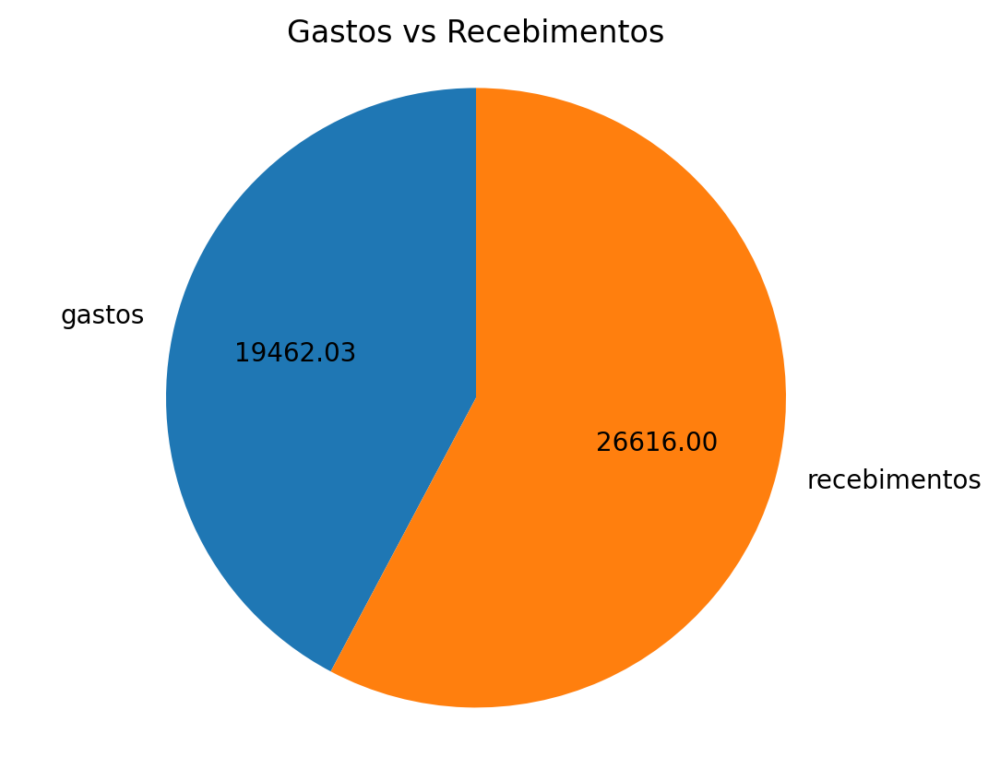
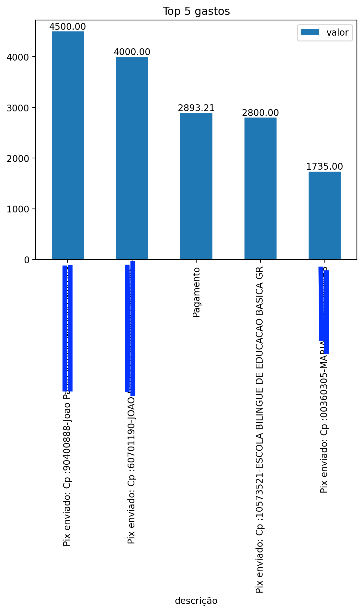
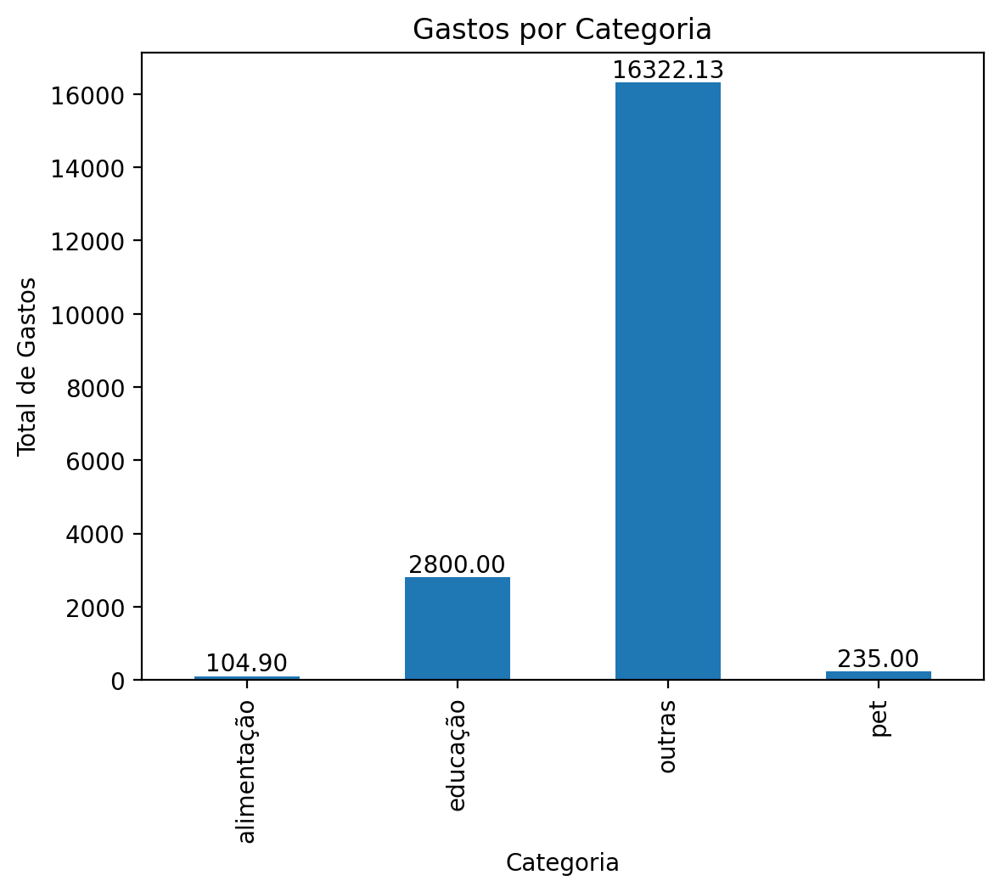

# Ánalise Financeira Domiciliar

## O que é:

Esse é um projeto de análise financeira que utiliza Streamlit, permitindo a visualização e análise dos dados de forma interativa e prática, a partir de arquivos PDF. A aplicação integra diversas funcionalidades para controle, visualização de gastos e recebimentos, para que o usuário organize suas finanças pessoais. 

## Suas funcionalidades são:

Extração de Dados: Leitura de múltiplos arquivos PDF contendo extratos financeiros bancários, usando a biblioteca pdfplumber.

Processamento com IA: Utilização da API GPT-4 para identificar e extrair automaticamente os valores e descrições de gastos e recebimentos.

Normalização dos Dados: Conversão dos dados extraídos para DataFrames do pandas e unificação das transações.

Categorização: Classificação das transações em categorias predefinidas com base na descrição, incluindo a categorização de recebimentos como "salário".

Visualização Interativa: Dashboards e gráficos interativos para análise dos dados financeiros

## Como usar:

* Pré-requisitos

Python 3.7+

Streamlit

pdfplumber

pandas

Bibliotecas de acesso à API OpenAI

Consulte o arquivo requirements.txt para ver e instalar todas as dependências necessárias.

* Para iniciar a aplicação, execute o comando abaixo na raiz do projeto:

streamlit run app.py

Isso abrirá uma interface web onde você poderá:

- Fazer upload de múltiplos PDFs contendo os extratos financeiros.

- Visualizar os dados extraídos e categorizados através de gráficos e tabelas.

- Analisar o fluxo de caixa com base nas transações classificadas.

## Como Funciona:

Upload de PDFs: O usuário faz o upload dos arquivos PDF com os extratos financeiros. (Extratos das contas, e não de fatura do cartão)

Extração do Extrato: O código utiliza pdfplumber para extrair o texto dos PDFs e compilar o extrato completo.

Processamento com GPT-4:

O extrato é enviado para a API GPT-4 com o prompt definido, que retorna um JSON contendo os gastos e recebimentos.

Os dados são transformados em DataFrames do pandas.

Categorização:

O DataFrame é convertido para JSON e enviado novamente para a API GPT-4 com outro prompt para categorizar as transações.

As transações são agrupadas por categoria e os valores são agregados.

Visualização:

A aplicação gera gráficos e tabelas para exibir as análises financeiras de forma interativa. 
Veja os exemplos abaixo: 

## Contribuição
Contribuições são bem-vindas! Se você deseja melhorar o projeto ou adicionar novas funcionalidades, sinta-se à vontade para abrir uma issue ou enviar um pull request.